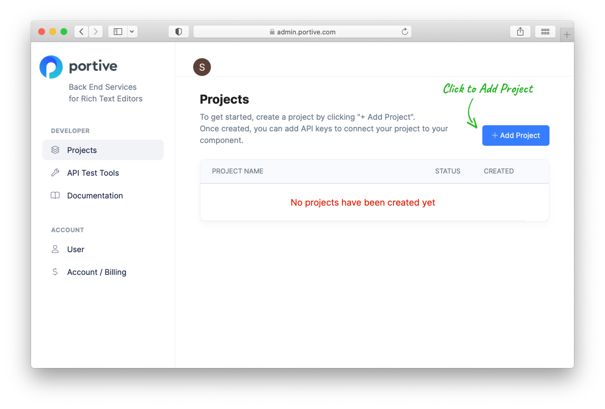
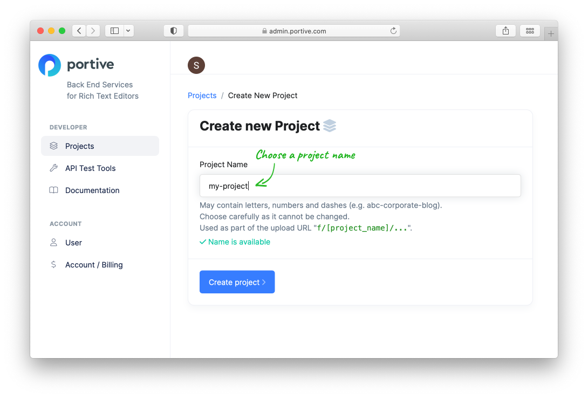
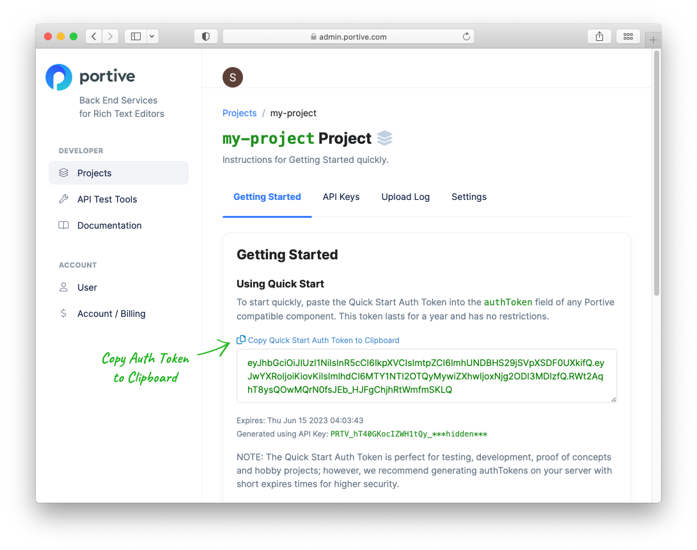

# Quick Start

Get an Auth Token in 60 seconds.

Go to [https://admin.portive.com](https://admin.portive.com) and login with a GitHub or Google account.

Click "Add Project" to create a project for your app.

Name your project after the app or website you're using it in.

Click "Create project".

Portive creates a Quick Start Auth Token for you.

Click **"Copy Quick Start Auth Token to Clipboard"** to copy then paste it into your Component.

Congratulations! You can now use any Portive enabled Component.

When you're ready to go to production, [generate shorter lived auth tokens on your server using an API key](./javascript.md). These give you more control and prevents users from re-using the same auth token for long periods of time.
